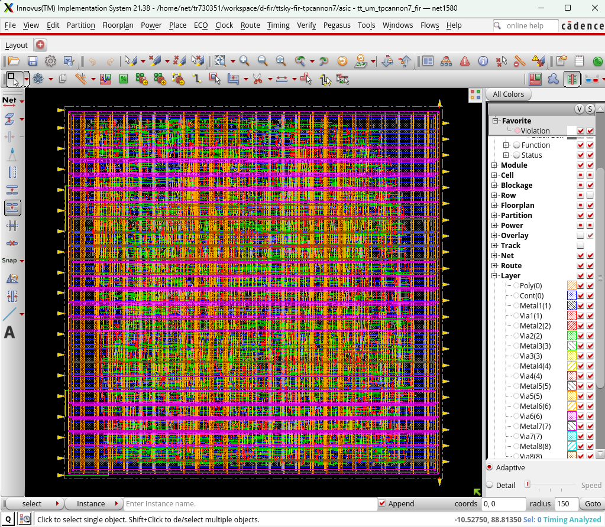
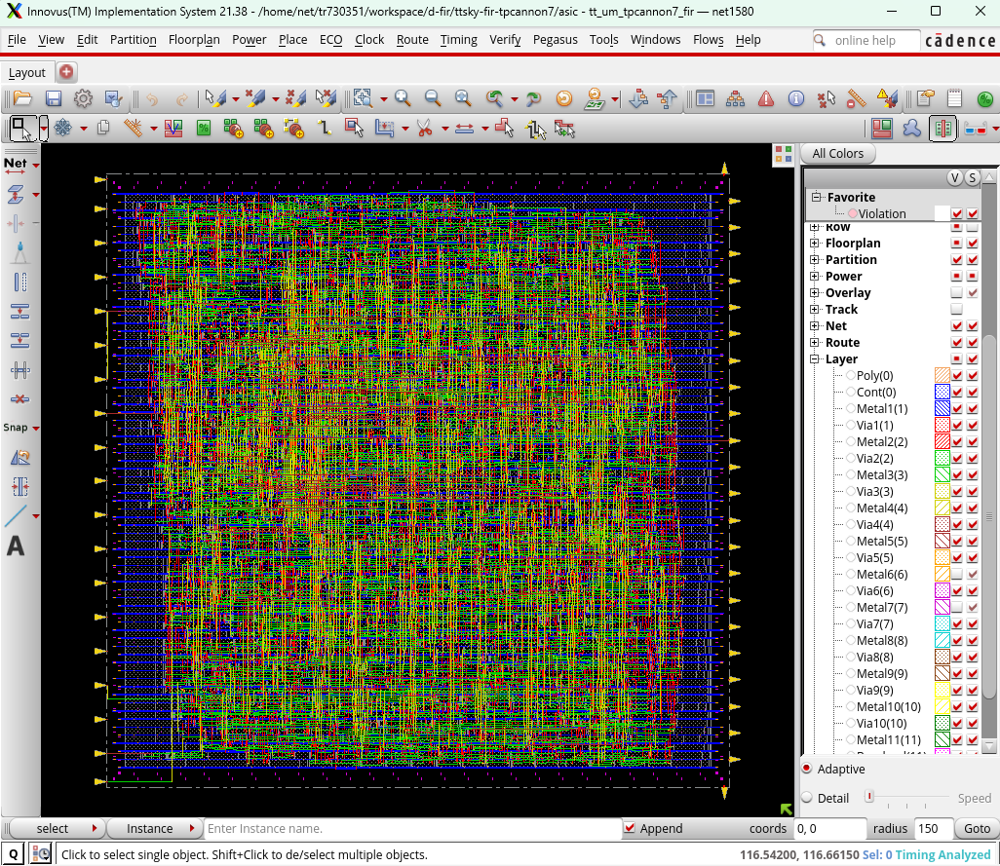

# Cadence RTL-to-GDSII Flow - GPDK045 (45 nm)

- Reimplements D-FIR RTL using Cadence Genus and Innovus with the generic GPDK045 45nm technology and standard cell library for synthesis, place-and-route, and timing analysis.
    - `synth.tcl`: Genus synthesis
    - `mmmc.tcl`: MMMC Analysis setup
    - `impl.tcl`: Innovus implementation flow
- Separate from submitted SKY130 GDS to TTSKY26c.

## Flow
1. RTL synthesis with Cadence Genus
2. Floorplanning and power planning
3. Placement
4. Clock-tree synthesis
5. Post-CTS timing optimization
6. Detailed routing
7. Post-route OCV/SI timing optimization
8. Filler insertion and ECO routing
9. DRC, connectivity, and placement verification
10. GDSII stream-out with GSCLIB045 standard-cell GDS merge

## Innovus Viewer

## Overall Results

| Metric | Result |
|---|---:|
| Technology | GPDK045 |
| Target clock | 40 MHz (25 ns) |
| Logical / implementation cells | 2,417 |
| Filler cells | 2,369 |
| Total placed instances | 4,786 |
| Standard-cell area (excluding fillers) | 11,040.102 µm² |
| Flip-flop count | 1,008 |
| Flip-flop area | 8,072.226 µm² |
| `SDFFRHQX1` count | 904 |
| `ADDFX1` count | 121 |
| Post-route placement density (excluding fillers) | 73.451% |
| Final setup WNS | +18.637 ns |
| Final setup TNS | 0.000 ns |
| Final hold WNS | +0.004 ns |
| Final hold TNS | 0.000 ns |
| Setup violations | 0 |
| Hold violations | 0 |
| Max transition violations | 0 |
| Max capacitance violations | 0 |
| Max fanout violations | 0 |
| Placement violations | 0 |
| DRC violations | 0 |
| Connectivity violations / warnings | 0 / 0 |

## Cell Type Breakdown
- Click to expand cell breakdown

 Full Standard Cell breakdown 

| Cell Type | Instance Count | Area (µm²) |
|---|---:|---:|
| `ADDFX1` | 121 | 620.730 |
| `ADDHX1` | 10 | 37.620 |
| `AND2X1` | 6 | 8.208 |
| `AND2X2` | 1 | 1.710 |
| `AND2X4` | 12 | 32.832 |
| `AND2X6` | 1 | 3.762 |
| `AND2XL` | 83 | 113.544 |
| `AND3X4` | 1 | 3.078 |
| `AND3XL` | 1 | 2.052 |
| `AO22XL` | 16 | 43.776 |
| `AOI211X1` | 1 | 2.394 |
| `AOI211XL` | 24 | 49.248 |
| `AOI21X1` | 6 | 10.260 |
| `AOI21XL` | 4 | 6.840 |
| `AOI221X1` | 72 | 172.368 |
| `AOI22X1` | 95 | 194.940 |
| `AOI22XL` | 291 | 597.132 |
| `AOI2BB1X1` | 1 | 2.052 |
| `AOI2BB1XL` | 1 | 2.052 |
| `AOI32X1` | 1 | 2.394 |
| `BUFX12` | 1 | 5.130 |
| `BUFX3` | 3 | 6.156 |
| `BUFX4` | 1 | 2.394 |
| `BUFX6` | 27 | 83.106 |
| `CLKBUFX12` | 1 | 5.130 |
| `CLKBUFX2` | 133 | 227.430 |
| `CLKBUFX3` | 11 | 22.572 |
| `CLKBUFX4` | 45 | 107.730 |
| `CLKBUFX8` | 3 | 11.286 |
| `CLKINVX6` | 2 | 4.788 |
| `CLKINVX8` | 1 | 3.078 |
| `CLKMX2X4` | 1 | 4.104 |
| `DFFRHQX1` | 83 | 510.948 |
| `DFFRX1` | 14 | 95.760 |
| `DFFSHQX1` | 7 | 45.486 |
| `DLY1X1` | 2 | 6.156 |
| `FILL1` | 760 | 259.920 |
| `FILL2` | 680 | 465.120 |
| `FILL4` | 491 | 671.688 |
| `FILL8` | 224 | 612.864 |
| `FILL16` | 100 | 547.200 |
| `FILL32` | 97 | 1,061.568 |
| `FILL64` | 17 | 372.096 |
| `INVX1` | 29 | 19.836 |
| `INVX2` | 1 | 1.026 |
| `INVX3` | 2 | 2.736 |
| `INVXL` | 4 | 2.736 |
| `NAND2BX1` | 8 | 10.944 |
| `NAND2BXL` | 1 | 1.368 |
| `NAND2X1` | 76 | 77.976 |
| `NAND2X2` | 4 | 6.840 |
| `NAND2XL` | 59 | 60.534 |
| `NAND3BXL` | 1 | 1.710 |
| `NAND3X1` | 1 | 1.710 |
| `NAND3X2` | 1 | 2.736 |
| `NAND4BX1` | 2 | 4.788 |
| `NAND4X1` | 25 | 51.300 |
| `NAND4X2` | 4 | 15.048 |
| `NAND4XL` | 70 | 119.700 |
| `NOR2BX1` | 6 | 8.208 |
| `NOR2BX2` | 2 | 5.472 |
| `NOR2X1` | 76 | 77.976 |
| `NOR2X2` | 1 | 1.710 |
| `NOR2XL` | 11 | 11.286 |
| `NOR3X1` | 1 | 1.710 |
| `NOR4X1` | 2 | 3.420 |
| `OA21X1` | 2 | 4.104 |
| `OAI211X1` | 5 | 8.550 |
| `OAI21X1` | 1 | 1.710 |
| `OAI21XL` | 1 | 1.710 |
| `OAI2BB1X1` | 16 | 27.360 |
| `OAI32X1` | 3 | 7.182 |
| `OR2X1` | 3 | 4.104 |
| `OR2X2` | 2 | 3.420 |
| `OR2XL` | 1 | 1.368 |
| `OR3X1` | 1 | 2.052 |
| `OR4X1` | 1 | 2.052 |
| `SDFFRHQX1` | 904 | 7,420.032 |
| `XNOR2X1` | 5 | 11.970 |
| `XOR2XL` | 2 | 5.472 |

