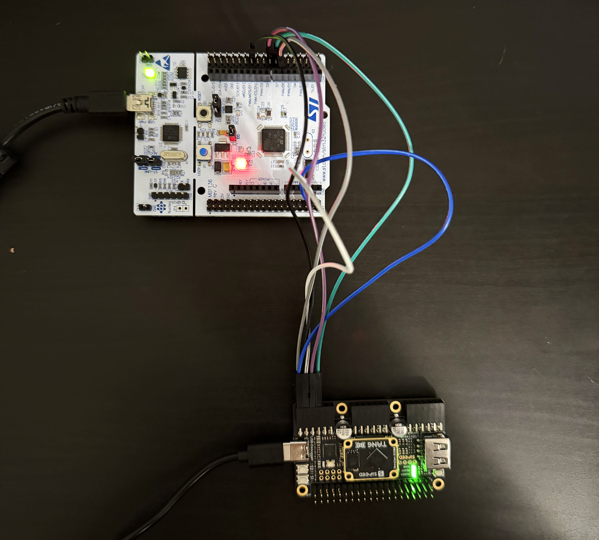
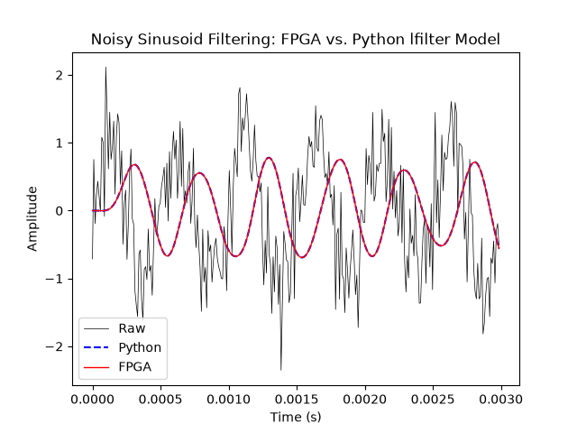
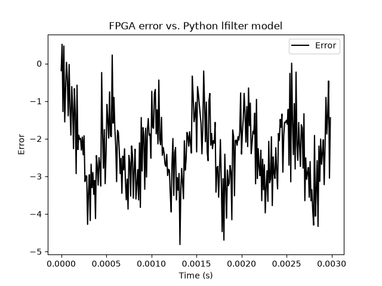

# D-FIR FPGA Bring-up and Validation
- FIR core, truncated multiplier, and SPI interface validated using an STM32 (Nucleo-F446RE) and Gowin GW5A FPGA (Sipeed Tang Primer 25K - GW5A-LV25MG121NC1/I0)
- FPGA configured @ 40 MHz to match the ASIC design target

## Validation Setup Block Diagram
- Python pySerial communicates over the ST-LINK COM port of STM32 to drive coefficients/samples
- STM32 acts as the SPI master to the FPGA to transfer coefficients/samples
- FPGA emulates the ASIC RTL, processes samples and sends back over SPI to the STM32

```
Python (pySerial, NumPy, SciPy)
   │
UART
   │
STM32
   │ SPI
   ▼
 Gowin FPGA
   │
SPI response
   │
STM32
   │
UART
   ▼
Python
```

### Image of Validation Test Setup


##  Validation
### SPI Interface
- SCLK @ 2.625 MHz
- The STM32 SPI interface was implemented using the STM32 SPI HAL and manual CS toggling to match the expected SPI framing of the RTL
    - FPGA/ASIC expects CS to be pulled high between each 16-bit transfer, the STM32 DMA HAL pulls CS low for the entire block transfer meaning we must manually toggle CS to achieve the expected behavior
- UART/SPI use block transfers of 256 bytes (128 16-bit SPI frames)
    - Coefficients are loaded in the very first block, placed in the lower N (N = # of taps) entries of the first block to mirror the internal shift behavior of the coefficient memory (the last N coefficients loaded are the final ones stored in that transaction)
    - Samples are arranged into the same block format and streamed over UART to the STM32, then over SPI to the FPGA
- The `FIR_MODE` pin was verified by alternating coefficient and sample transfers and observing the expected filter behavior

### FIR Functionality
- FPGA outputs were compared with a Python SciPy lfilter model using the exact same coefficients, lfilter model used floating point coefficients while the FPGA used the fixed point format (Q1.11 coefficients, Q12.0 samples)
- FPGA output closely followed the Python model with reasonable bounded error (show in the below plot)

### FPGA Sinusoid Filtering vs. Python lfilter Model

- FPGA outputs closely follow the Python model, confirming the FIR core/multiplier -> control -> SPI interface all work as expected

### FPGA error vs. Python lfilter Model

- Error remained bounded to approximately ±5 LSBs with respect to the floating point reference, confirming the truncated multiplier and fixed-point representation are within a reasonable threshold


## Issues Encountered
- During FPGA validation, the original custom truncated multiplier passed RTL and gate-level simulation but produced incorrect behavior after Gowin synthesis
- The implementation was rewritten using equivalent continuous combinational assignments in place of procedural combinational logic
    - Gowin Synthesis appeared to handle procedural combinational assignments differently than Yosys did during gate-level simulation
- The revised implementation matched the Python reference model and increased the maximum operating frequency from 24 MHz to 61 MHz while reducing LUT utilization
- Revised implementation of the truncated multiplier at `fpga/src/new_trunc_mult.v`
- Functional equivalence between the original and revised RTL implementations was formally verified using Yosys equivalence checking, confirming that the RTL rewrite preserves the original design's functionality while improving compatibility with the Gowin synthesis flow
- Yosys equivalence script located at `fpga/trunc_mult_equiv.tcl`

| FPGA Statistics    |  Original Multiplier |   Revised Multiplier |
| -------------------| --------------------:| --------------------:|
| LUTs               |       999            |       825            |
| Registers          |      1006            |      1006            |
| Logic Levels       |        47            |        24            |
| Fmax               | 24.05 MHz            | 61.36 MHz            |
