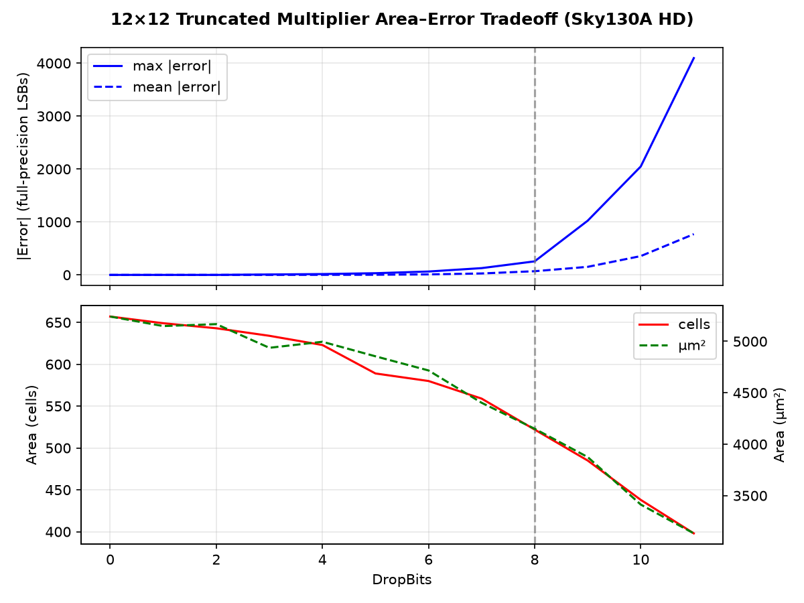
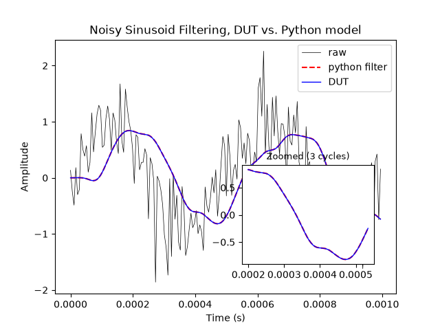
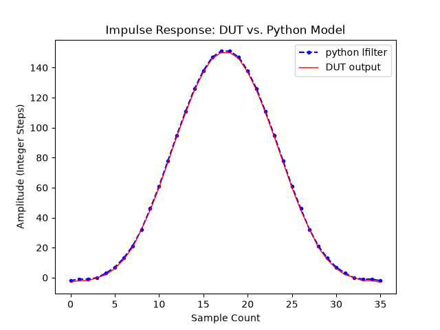
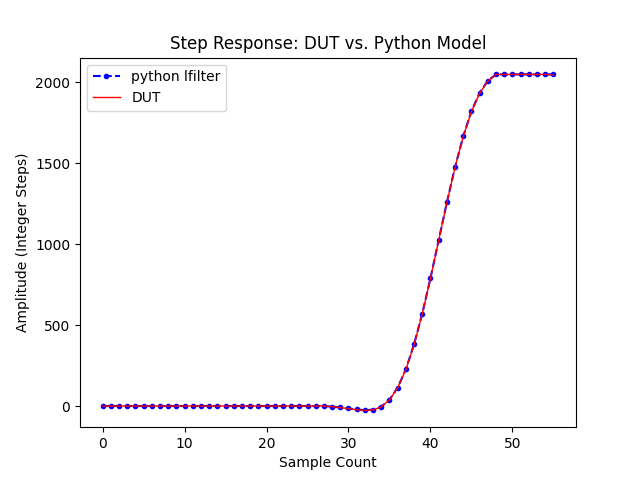
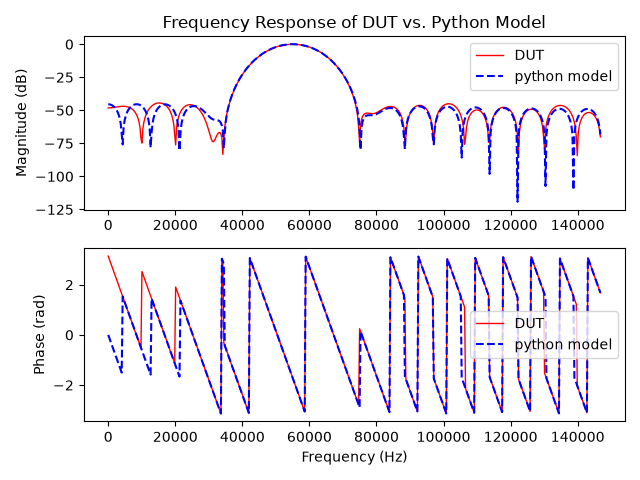

<!---

This file is used to generate your project datasheet. Please fill in the information below and delete any unused
sections.

You can also include images in this folder and reference them in the markdown. Each image must be less than
512 kb in size, and the combined size of all images must be less than 1 MB.
-->

## General Operation

 - Load 12-bit samples or coefficients over SPI interface
    - Use FIR_MODE `ui_in[0]` pin to switch between coefficient/sample loading
        - FIR_MODE = 1 (SAMPLE)
        - FIR_MODE = 0 (COEFFICIENT)
    - Coefficients are in format Q1.11, 11 decimal bits
        - When generating coefficient vector, ensure you multiply each floating point coefficient by $2^{11}$ and round to the nearest whole number to match Q1.11 input range of [-2048, 2047] for 12-bit signed integers
        - Coefficients are not required to be symmetric, allowing both linear-phase and non-linear-phase FIR filters to be implemented
    - Coefficients must be loaded in **reverse order** (last tap first) due to the coefficient shift register architecture
        - Your coefficient vector `[c35, c34, ..., c1, c0]` should be sent over SPI as `c0, c1, ..., c34, c35`
    - There is an expected amount of error due to the fixed point representation and truncated multiplier precision
        - Truncated multiplier accumulates error across taps due to serial MAC architecture (one multiplier is used across all taps)
        - See the Area–Error Tradeoff section below for a quantified analysis with Sky130A synthesis data
    - **Recommended first test:**
        - Generate own array of filter coefficients using Python or other online tools (ex. Python SciPy firwin function)
        - Load coefficients over SPI
        - Send impulse response (impulse is equal to 2047 which is max positive value at 12 bit signed)
        - Verify outputs match within an acceptable range to loaded filter coefficients (acceptable range is around 1-2 integer steps, you may load a coefficient of -5 but receive back an output of -6)

### Coefficient Reloading
 - Coefficients are runtime programmable through the use of the FIR_MODE pin with some additional notes
   - On fresh startup of filter, best practice is to load your coefficients for all taps and then continuously stream samples
   - If a coefficient reload is desired to change filter behavior during runtime, the recommended setup is to flush the entire sample line with 0x0000/NOPs equal to tap count (36 taps) to not corrupt the filter math with stale samples and then load new coefficients
   - Outputs during this NOP/reloading phase should be ignored; they are stale calculations from the previous filter settings

## Validation
- Design was functionally validated on a Gowin GW5A FPGA using an STM32 Nucleo-F446RE SPI master
- Validation methodology and measured results are documented in `bringup/README.md`

## SPI Overview
  - System clock is 40 MHz, recommended SCLK $\leq$ ~4-5 MHz
  - 16 bit frames; MSB leading, remaining lower bits padded with 0's
    - With 16 bit frames @ SCLK = 5 MHz, the sampling rate is about:
        - Total SPI frame time = 200ns per bit * 16 bits + cs_n high between frames = 3400ns -> 294 kSps / 2 (Nyquist) = 147 kHz maximum theoretical recoverable signal frequency; real-world maximum will land slightly below
  - SPI Mode 0 only
  - MISO is driven LOW during idle, not tri-stated; do not share MISO line with other SPI slaves unless externally isolated or muxed
  - CS_N high time between frames must be one cycle of SCLK, (For 5 MHz, CS_N high between frames should be 200ns)
  - MISO is valid 2 core clock cycles after CS_N falls (3-stage synchronizer + edge detection). At 40 MHz this is 50 ns. The SPI master must not start SCLK sooner than this after asserting CS_N low, or the first MISO bit may be stale.
  - Set `ui_in[0]` pin (FIR_MODE) at the beginning of each SPI transaction to your desired transmission type
    - FIR_MODE = 1 (SAMPLE)
    - FIR_MODE = 0 (COEFFICIENT)
    - The mode pin is sampled in the middle of the SPI frame; recommend setting pin at the beginning of the frame
 - Safe operation of filter assumes SPI clock within documented ranges, there is no backpressure/overrun control if you operate above recommended ranges

### SPI Output Timing

- Full duplex SPI interface
    - MISO returns previous results while you send new samples on MOSI 
    - This creates a pipeline with a fixed latency:

| SCLK speed | Pipeline lag (k) | Leading garbage frames | Trailing NOPs needed |
|------------|:---:|:---:|:---:|
| 2–5 MHz | 2 | First 2 MISO outputs | Send 2 × 0x0000 at end |
| ≤1 MHz | 1 | First 1 MISO output | Send 1 × 0x0000 at end |

**Example (k=2):** sending `[A, B, C, D, E]` over MOSI:

| Frame | MOSI in | MISO out |
|-------|---------|----------|
| 1 | A | garbage |
| 2 | B | garbage |
| 3 | C | result of A |
| 4 | D | result of B |
| 5 | E | result of C |
| 6 | 0x0000 | result of D |
| 7 | 0x0000 | result of E |

### SPI Timing

Loading Samples: 
```
MODE _/¯¯¯¯¯¯¯¯¯¯¯¯¯¯¯¯¯¯¯¯¯¯¯¯¯¯¯¯¯¯¯¯¯¯¯¯¯¯¯¯¯¯¯¯¯¯¯¯¯¯¯¯¯¯¯¯¯¯¯¯¯¯¯¯¯¯¯¯¯¯¯¯¯¯¯¯¯¯¯¯¯\_
CS_N  \__________________________________________________________________________________/
SCLK  _/¯\_/¯\_/¯\_/¯\_/¯\_/¯\_/¯\_/¯\_/¯\_/¯\_/¯\_/¯\_/¯\_/¯\_/¯\_/¯\_/¯\_/¯\_/¯\_/¯\_/¯\_
MOSI  X  b15  b14  b13  b12  b11  b10  b9   b8   b7   b6   b5   b4   b3   b2   b1   b0  X
MISO  X  d15  d14  d13  d12  d11  d10  d9   d8   d7   d6   d5   d4   d3   d2   d1   d0  X
```

Loading Coefficients:
```
MODE \___________________________________________________________________________________/
CS_N  \__________________________________________________________________________________/
SCLK  _/¯\_/¯\_/¯\_/¯\_/¯\_/¯\_/¯\_/¯\_/¯\_/¯\_/¯\_/¯\_/¯\_/¯\_/¯\_/¯\/¯\_/¯\_/¯\_/¯\_/¯\_
MOSI  X  b15  b14  b13  b12  b11  b10  b9   b8   b7   b6   b5   b4   b3   b2   b1   b0  X
MISO  X  d15  d14  d13  d12  d11  d10  d9   d8   d7   d6   d5   d4   d3   d2   d1   d0  X
```

## Truncated Baugh-Wooley Multiplier Design

- 12x12 bit multiplier, truncating (dropping) the bottom 8 LSP (Least Significant Product) bits [7:0]
- Uses the Baugh-Wooley algorithm to handle signed multiplication
    - "A Two's Complement Parallel Array Multiplication Algorithm" Baugh and Wooley
- Uses error correction scheme with IC terms to handle error stemming from truncation
    - "Low Error Truncated Multipliers for DSP Applications" Garofalo et al.
    - Optimized for lowest mean square error along with area

### Overview
- **Truncated multiplier to minimize area**
    - We use truncation specifically due to the fixed point of the coefficient terms in the FIR filter math
    - In standard binary multiplication, we would compute all 24 product columns and their partial products stemming from the 12x12 multiplication
    - The idea behind the truncated multiplier is that because our coefficients are represented in Q1.11 (11 fractional bits), we can drop a number of the fractional bits and maintain a good level of precision while saving hardware area
    - In our case, we drop 8 of the 11 fractional bits. This means that in our multiplication of 12x12 bit numbers, we never compute the lower 8 partial product columns, saving area that would be spent on adders, AND gates, etc.
- **Partial Product Calculation**
    - This section will give an overview to the general steps taken to perform binary multiplication in our case
    - We first create a bit vector of all partial products per column, largest possible width is 12 partial products in a column in our case (width of multiplicand). Each bit position in this vector will store one partial product which is the result of an AND operation between two of the multiplier operand bits ($a_i$ & $b_j$ = $pp_{ij}$)
    - With bit vectors for each partial product column computed, we go down the column and sum them how you would in normal multiplication; ex. partial product column 2 may have a result that is [1,0,1] = sum across that vector and the final result is binary 010 (2 in decimal). 
    - Finally, we accumulate across each summed product columns into a final result accumulator vector, **making sure to account for the weight of each column** (ex. we shift left 12 bits for partial product column 12 to align with the correct bit position and preserve weighting)
- **Baugh-Wooley Algorithm** ("A Two's Complement Parallel Array Multiplication Algorithm" Baugh and Wooley)
    - An issue with the truncation method is that it does not natively handle signed (2's complement) multiplication
    - This is fixed by using the Baugh-Wooley algorithm which inverts certain terms in partial products along with the addition of new terms in partial product columns
        - Every y and x term less than ($y_i$ < $y_{m-1}$) and ($x_i$ < $x_{n-1}$) is inverted in their respective partial product pairs
        - Special case for $y_i$ = $y_{m-1}$ and $x_i$ = $x_{n-1}$ where this partial product pair is left unchanged (no inversion)
        - Extra terms added
            - Inverted single terms of $y_{m-1}$ and $x_{n-1}$ are added to the OutputWidth - 2 (12x12 = 24 bit -> Column/bit 22) partial product column 
            - Single bit "1" added to the final partial product column, OutputWidth - 1 (Column/bit 23)
            - Two single $y_{m-1}$ and $x_{n-1}$ terms are added at $P_{m-1}$ and $P_{n-1}$ respectively, special case when m = n (both operands are equal bit width) where terms are added to the same partial product column
- **IC Error Correction** ("Low Error Truncated Multipliers for DSP Applications" Garofalo et al.)
    - Truncation involves some intrinsic error due to lost partial product terms and carry out from dropped partial product columns
    - We can recover some accuracy by implementing an error correction scheme
    - Since we drop the bottom 8 bits/columns, and our bit width for our inputs equals to 12, we compute our "h" term to be input bit width - dropped bits = 4.
        - "h" represents the number of extra bits kept beyond the minimum necessary of n = 12 bits (matching our input bit width)
    - In order to implement the error compensation, we must calculate the partial products in the one column below our first non-dropped column
        - In our case, drop bits = 8, in our truncated multiplier we compute partial products for columns [23:8]. We must now compute one column lower at column 7 (8 - 1 = column 7)
        - Once this extra lower column has their partial products computed, we must apply the correct f(IC) function on specific bits (Eq. 20, pg. 31)
        - For partial products i = 1, 2, n-h-1 (12 - 4 - 1 = 7), n-h (12 - 4 = 8) we will sum them together and shift them all by $2^{-n-h-1}$ where -n-h-1 = -12-4-1 = -17
            - *These are our "edge IC terms"*
        - For partial products 2 < i < n-h-1 (12 - 4 - 1 = 7), we apply the shift of $2^{-n-h}$ or $2*2^{-n-h-1}$ (-n-h = -12-4 = -16 -> $2^{-16}$) to them, with our K term coming to be 0
            - *These are our "middle IC terms"*
        - The term shift can be confusing in this context especially with using negative power of 2 terms
            - The paper uses reverse style for MSB and LSB where the MSB (or most significant product) is at $2^{-1}$ place and the LSB (least significant product) is at the $2^{-2n}$ place
            - Since our output with 12x12 multiplication is 24 bits and we truncate the bottom 8 bits for our output, we must align these at 17 and 16 bits from the left respectively
            - This comes out to 24 - 17 = 7 and 24 - 16 = 8. These fit into partial product column 7 and 8 respectively
        - We must align the edge IC sum partial products and the middle IC sum partial products to their respective bit positions and add them to the main accumulation term
        - One thing to notice is that we do not have a bit 7 in our output of [24:8]. We must expand our accumulator term by one bit width on the LSB side, align the edge IC term with that lower bit and then add normally
        - The middle IC terms align to bit 8, so since we add that lower bit to account for the edge IC addition we shift left by 1 to align the middle IC terms with the correct bit and add normally
        - *Note: this extra bit alters the original truncated multiplier shifting in the accumulate stage; we must shift one extra bit each time to account for the extra guard bit added for the IC term alignment to preserve prior weighting for each column*


### Area–Error Tradeoff



The truncated multiplier was synthesized across all DropBits values (0–11) against the Sky130A HD standard cell library. The plot shows max and mean absolute error vs cell count and chip area.

| DropBits | Max \|error\| (full LSB) | Cells | Area (µm²) |
|----------|---------------------------|-------|------------|
| 0 | ≤2 | 657 | 5241 |
| 4 | ≤32 | 634 | 4937 |
| 8 | ≤512 | 522 | 4150 |
| 11 | ≤4096 | 398 | 3133 |

**Design point: DropBits = 8** (vertical dashed line). At this level:
- Error bound: ≤±2 truncated-output LSBs (≤512 full-precision LSBs)
- ~27% cell savings vs a raw `*` operator synthesized through the same flow (717 cells baseline)
- FIR output visually indistinguishable from the ideal floating-point reference (see Noisy Sinusoid Filtering below)

## Noisy Sinusoid Filtering



A 2kHz sinusoid with added Gaussian noise filtered by the DUT with low-pass coefficients (10 kHz) vs the Python lfilter model.

## Impulse Response



The DUT output (red) overlaid on the ideal fixed-point coefficients (blue). Generated with 50–60 kHz band-pass coefficients.

## Step Response



The DUT step response (red) vs Python lfilter (blue). The FIR fills in over 36 taps and then converges to the expected steady state step response.

## Frequency Response



50–60 kHz band-pass frequency response, reconstructed from measured impulse response test
