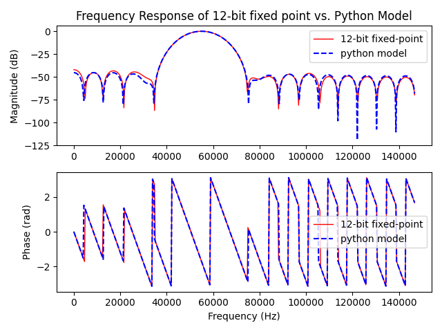
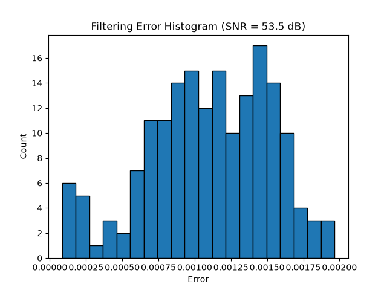

<!---

This file is used to generate your project datasheet. Please fill in the information below and delete any unused
sections.

You can also include images in this folder and reference them in the markdown. Each image must be less than
512 kb in size, and the combined size of all images must be less than 1 MB.
-->

## SPI Overview

  - 16 bit frames; leading MSB, remaining lower bits padded with 0's
  - SPI Mode 0 only
  - SCLK speed up to 3-4MHz
  - Depending on chosen SCLK speed may require different number of don't care leading SPI frames + trailing NOP frames to drain all FIR results
      - First few frames of SPI will contain garbage data (0's) before results are shown
      - After the final sample is input, N number of NOP frames (0x0000) samples are required to be sent to drain final result
  - NOP frames needed depend on FIR compute pipeline depth:
      - At 3MHz SCLK: 2 trailing NOP frames
      - At higher SCLK speeds, more NOP frames may be required
      - NOPs are dummy SPI transactions that shift out the last FIR result from the MISO shift register

## How it works

 - Load samples or coeffcients over SPI interface
    - Use MODE ui_in[0] pin to switch between coeffcient or sample loading
    - MODE 0 (LOW): Coeffcients; MODE 1 (HIGH): Samples
    - Coeffcients are in format Q1.11, 11 decimal bits
        - When generating coeffcient vector, ensure you multiply by $2^{11}$ and round to the nearest whole number to match the expected input shape
    - Coeffcients must be loaded in **reverse order** (last tap first) due to the coefficient shift register architecture
    - Quantization error: expected ±1-2 LSB per tap vs ideal floating-point
        - This is normal behavior from the truncated multiplier and accumulates with tap count
        - Example: expected tap value of -5 may produce -6 in hardware (~28 LSB worst case for 28 taps)

## How to test

- Recommended to generate own array of filter coeffcients using Python or other online tools
- Load coeffcients over SPI
- Send impulse response and verify outputs match with loaded filter coeffcients

## SPI Timing

```
CS_N  \___________________________________________________/
SCLK  _/¯\_/¯\_/¯\_/¯\_/¯\_/¯\_/¯\_/¯\_/¯\_/¯\_/¯\_/¯\_/¯\_/¯\_/¯\_/¯\___
MOSI  X  b15  b14  b13  b12  b11  b10  b9   b8   b7   b6   b5   b4   b3   b2   b1   b0  X
MISO  X  d15  d14  d13  d12  d11  d10  d9   d8   d7   d6   d5   d4   d3   d2   d1   d0  X
                                                    ^
                                            MODE sampled here (bit 8)
```

- 16 clock cycles per frame
- MOSI driven on SCLK falling edge, MISO sampled on SCLK rising edge (SPI Mode 0)
- MODE pin (ui_in[0]) is sampled at bit 8 (mid-frame) to determine coefficient vs sample loading
- Data is 12-bit, right-padded with 4 zero bits to fill the 16-bit frame

## RP2040 Bringup

```c
#include "hardware/spi.h"
#include "pico/stdlib.h"

#define PIN_CS    17
#define PIN_SCK   18
#define PIN_MOSI  19
#define PIN_MISO  16
#define PIN_MODE  20
#define SPI_PORT  spi0

void fir_init(void) {
    spi_init(SPI_PORT, 3000 * 1000);  // 3MHz
    gpio_set_function(PIN_SCK,  GPIO_FUNC_SPI);
    gpio_set_function(PIN_MOSI, GPIO_FUNC_SPI);
    gpio_set_function(PIN_MISO, GPIO_FUNC_SPI);

    gpio_init(PIN_CS);
    gpio_set_dir(PIN_CS, GPIO_OUT);
    gpio_put(PIN_CS, 1);  // idle high

    gpio_init(PIN_MODE);
    gpio_set_dir(PIN_MODE, GPIO_OUT);
    gpio_put(PIN_MODE, 1);  // default sample mode
}

static uint16_t fir_spi_transfer(uint16_t data) {
    uint16_t rx;
    gpio_put(PIN_CS, 0);
    sleep_us(1);
    spi_write16_read16(SPI_PORT, &data, &rx, 1);
    gpio_put(PIN_CS, 1);
    sleep_us(1);
    return rx;
}

void fir_load_coeffs(int16_t coeffs[], int len) {
    gpio_put(PIN_MODE, 0);   // coefficient mode
    sleep_us(1);
    for (int i = len - 1; i >= 0; i--) {  // last tap first
        uint16_t frame = (uint16_t)(coeffs[i] & 0x0FFF) << 4;
        fir_spi_transfer(frame);
    }
    gpio_put(PIN_MODE, 1);   // back to sample mode
}

int16_t fir_process_sample(int16_t sample) {
    uint16_t frame = (uint16_t)(sample & 0x0FFF) << 4;
    uint16_t rx = fir_spi_transfer(frame);
    int16_t result = (rx >> 4) & 0x0FFF;
    if (result & 0x0800) result |= 0xF000;  // sign-extend 12-bit to 16-bit
    return result;
}
```

Note: CS_N must be driven manually as a GPIO (not hardware SPI CS) to control inter-frame timing.

## Impulse Response


The DUT output (red) overlaid on the ideal fixed-point coefficients (blue). The error subplot shows ±1-2 LSB per tap, consistent with the truncated multiplier's quantization.

## Step Response


The DUT step response (red) vs Python lfilter (blue). The FIR fills in over 28 taps and converges to the expected DC gain. The error subplot captures per-sample deviation.

## Frequency Response



The frequency response of the DUT (fixed-point) vs the Python ideal model (floating-point). The quantization error from the truncated multiplier causes a slight deviation near the stopband, visible as a small SNR penalty (~30-50dB depending on input). The phase plot confirms linear phase response expected from a symmetric FIR filter.

## Noisy Sine Filtering


A 2kHz sinusoid with added Gaussian noise filtered by the DUT vs the Python lfilter model. The DUT tracks the ideal output closely; the SNR between the two is typically above 30dB.

## Error Histogram



The distribution of (DUT - Python model) errors across all samples in the noisy sine test. The histogram is centered near zero with a spread of roughly ±3 LSB, confirming the truncated multiplier error is unbiased and well-behaved.